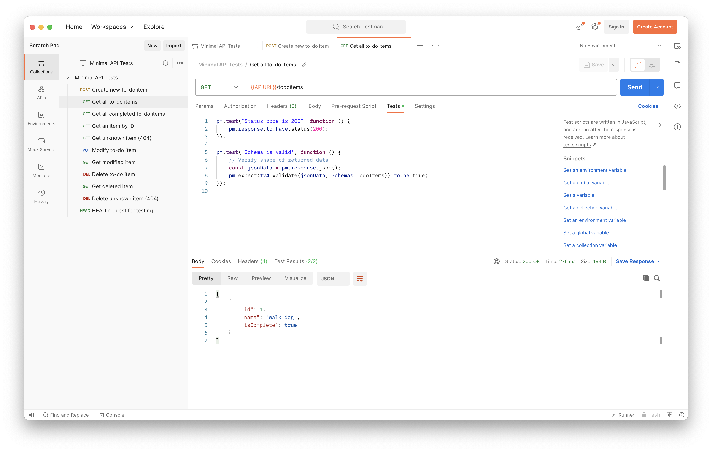

# .NET Minimal API Example

[](https://github.com/anishkny/dotnet-minimal-api-example/actions/workflows/ci.yml)
[](https://codecov.io/gh/anishkny/dotnet-minimal-api-example)

This repository follows along and implements this tutorial: [Create a minimal API with ASP.NET Core](https://learn.microsoft.com/en-us/aspnet/core/tutorials/min-web-api?view=aspnetcore-7.0&tabs=visual-studio-code).

> Minimal APIs are architected to create HTTP APIs with minimal dependencies. They are ideal for microservices and apps that want to include only the minimum files, features, and dependencies in ASP.NET Core.

## Getting Started

### Prerequisites

- [.NET SDK](https://dotnet.microsoft.com/download) (Version 7 or later)
- [Node.js](https://nodejs.org/en/) (Version 18 or later)
- [PostgreSQL](https://www.postgresql.org/) (Version 15 or later)

### Installation

1. Clone this repository

```bash
git clone https://github.com/anishkny/dotnet-minimal-api-example.git
```

2. Install dependencies

```bash
cd dotnet-minimal-api-example
npm install
```

### Usage

1. Start a PostgreSQL server

```bash
docker run -p 5432:5432 -e 'POSTGRES_PASSWORD=password' postgres:15-alpine
```

Alternately, you can specify a custom environment variable `POSTGRES_CONNECTION_STRING` to connect to a PostgreSQL server running elsewhere.

2. Run the application

```bash
npm run build
npm run start
```

3. Open a browser and navigate to [http://localhost:5000/todoitems](http://localhost:5000/todoitems)

### Migrations

If you make changes to the database models, you will need to generate a new migration and apply it to the database.

```bash
dotnet ef migrations add -o migrations <migration-name>
```

All migrations are stored in the [`src/migrations`](./src/migrations) directory.

### Running Tests

```bash
npm run start-and-test
```

### Postman Collection

Included is a Postman collection that can be used to test the API. You can import the collection by opening Postman and clicking on `File > Import...` and selecting the [`api-tests.postman_collection.json`](./api-tests.postman_collection.json) file.



It is also used for automated testing via the `newman` tool.

### Coverage

After running the test suite, you can view the code coverage report by opening the `coveragereport/index.htm` file in a web browser.

## License

This project is licensed under the [MIT License](https://opensource.org/license/mit/) - see the [LICENSE](LICENSE) file for details.
